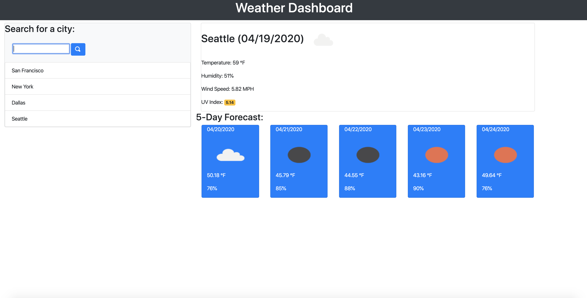

# Weather Dashboard

## Description 
This application uses server-side API and JavaScript to create a weather dashboard.

## Table of Contents
* [Installation](#installation)
* [Usage](#usage)
* [License](#license)
* [Contributing](#contributing)
* [Tests](#tests)
* [Questions](#questions)

## Installation 
This does not require installation. 

## Usage 
The usage of this application should only be to view my portfolio. 
Please view live Git Hub [URL](https://nicolewallace09.github.io/weather-dashboard/) 

## License 
This project is license under MIT

## Contributing 
Contributors should read the installation section. 

## Tests
There are no tests for this application. 

## Questions
If you have any questions about this projects, please contact me directly at nicole.elisaw@gmail.com. You can view more of my projects at https://github.com/nicolewallace09.
